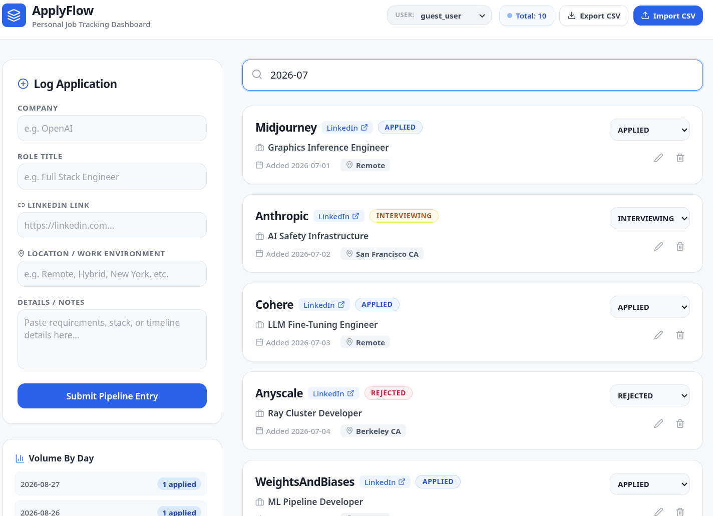

# ApplyFlow 🚀

ApplyFlow is a lightweight, self-hosted, full-stack job application tracker designed to run seamlessly on your local network or a Raspberry Pi. It provides real-time fuzzy search, server-side pagination, idempotent Excel/CSV utilities, and daily metrics visualization without heavy third-party tracking footprints.

---

## 🏗️ Technical Architecture

- **Frontend Mainframe:** React 18, Vite, TypeScript, Tailwind CSS, Lucide Icons.
- **Fuzzy Search Processing:** Fuse.js client-side multi-key indexing engine.
- **Backend Core Routing Engine:** Spring Boot 3 (Java 21), Spring Data JPA, Tomcat.
- **Security Control Configuration:** Spring Security Context with explicit CORS handling.
- **Data Persistence Store:** Persistent File-Backed H2 Database Engine.
- **Orchestration Layer:** Docker & Docker Compose (Multi-stage ARM/x86 optimized caches).

---

## 📁 System Topology Matrix

```text
job-tracker-system/
│
├── backend/                  # Spring Boot Java Engine Services
│   ├── src/
│   ├── pom.xml               # Target build Java 21 properties compilation profiles
│   └── Dockerfile            # Optimized dependency caching layer recipe (Alpine runtime)
│
├── frontend/                 # React UI Client SPA
│   ├── src/
│   ├── package.json          # Transpilation script configuration settings
│   └── Dockerfile            # Multi-stage production static bundle asset Nginx setup
│
└── docker-compose.yml        # Multi-service network link binding blueprint
```

---

## 🚀 Rapid Deployment & Startup

### Prerequisites

Ensure you have [Docker](https://docker.com) and [Docker Compose](https://docker.com) installed on your target machine (Laptop, Server, or Raspberry Pi).

### Command execution

Navigate to the absolute root directory containing your `docker-compose.yml` file and execute the single container builder orchestrator command:

```bash
docker compose up -d --build
```

### Script Execution Lifecycle Operations:

1. Docker reads individual folder environments, isolates layer steps, and compiles runtime variables.
2. Maven builds your executable backend jar targets within a lightweight, ultra-secure Java 21 Alpine container.
3. Vite packages your static web dashboard bundles and loads them inside a high-performance **Nginx reverse-proxy server**.
4. The system automatically provisions a local persistent directory folder on your host environment disk tracking files inside `./backend/data`.

---

## 📍 Local Network Access Points

Once initialization routines complete successfully, you can access your private data pipeline tracker using any device (Desktop, phone, laptop) connected to your local home Wi-Fi network:

- **Direct Interface URL:** `http://localhost` (Port `80` managed implicitly via Nginx routing configurations)
- **Direct Backend API Raw JSON Endpoint:** `http://localhost:8080/api/jobs`
- **Raspberry Pi Local Home Network Navigation:** `http://<YOUR_RASPBERRY_PI_LOCAL_IP_ADDRESS>` (Find your host network pointer address by running `hostname -I` in your Pi terminal window prompt).

---

## Screenshot



## 🛠️ Feature Documentation Reference Guide

### 1. Instant Multi-Field Substring Filtering

The primary top text submission console box parses and checks properties dynamically across separate layers:

- **String Filtering Tokens:** Type alphanumeric sequences like `OpenAI`, `Remote`, `Hybrid`, or custom description requirements notes. Fuse.js scans the cached data array and filters rows down instantly.
- **Strict Timeline Tracking Isolation:** Type a calendar segment constraint format following `YYYY-MM` patterns (such as `2026-08`). The custom JavaScript router overrides fuzzy algorithms to cleanly isolate applications logged specifically during that calendar month.

### 2. Auto-Seeded Data Idempotence Imports

Clicking **Import CSV** loads external raw text sheets into active storage structures securely. 

- **Column Scheme Specifications:** Upload spreadsheets formatting rows exactly across these matching metadata categories: `Company,Role,Status,AppliedDate,Location,Link,Description`.
- **Duplicate Prevention Safeguard Logic:** Your Spring Data processing backend checks row values against your persistent database keys. If a row contains a company, title, and location matching an entry you already applied to, it automatically skips compiling that cell row, protecting your active boards from clutter.

### 3. Automatic Server-Side Processing Dates

When tracking records using the frontend interface panels, manual entry forms completely ignore date input prompts. The Spring Boot `@PostMapping` intercept loop automatically binds `LocalDate.now()` inside database files, standardizing timestamp entries based on the exact day you applied.

### 4. Continuous Layout Persistence

A physical relational database file is mounted directly onto your disk storage array. Stopping your docker containers or restarting your host server hardware completely will not affect data. All records remain locked securely on your drive space inside `./backend/data/jobtrackerdb.mv.db`.

---

## 🧪 System Scaling & Threshold Capacities

The current configuration handles up to **10,000+ personal job application entries** comfortably before encountering client-side browser performance adjustments:

- **Server API Performance Efficiency:** Handles up to several hundred transactions per second out of the box using built-in Spring web filters.
- **DOM Protection Logic:** Pages are rendered using chunks of 10 list rows. This keeps browser rendering engines fast and lightweight even with substantial amounts of data.

# 
